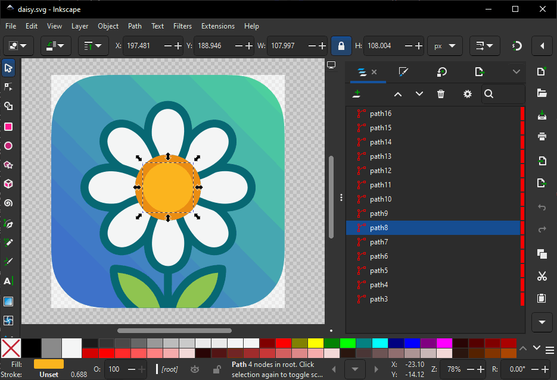

# Daisy Cutter

Inkscape extension that punches a hole through every object beneath a selected shape.



With stock Inkscape, **Path → Difference** only cuts one pair at a time. You select the cutter and a single path under it, run Difference, duplicate the cutter, and do it again for the next path. That gets old fast on a busy design.

Daisy Cutter runs that loop for you. Select one **cutter** object; it subtracts that shape from every object below, leaving a hole in the cutter's outline. Each cut object keeps its own fill, stroke, and style. The cutter is deleted when done (optional: keep it).

## Install

Copy the extension files into your Inkscape extensions directory:

```bash
# Linux
cp daisy_cutter.py daisy_cutter.inx ~/.config/inkscape/extensions/

# macOS
cp daisy_cutter.py daisy_cutter.inx ~/Library/Application\ Support/org.inkscape.Inkscape/config/inkscape/extensions/

# Windows
copy daisy_cutter.py daisy_cutter.inx %APPDATA%\inkscape\extensions\
```

Restart Inkscape after installing.

## Usage

1. Put the cutter **above** the objects you want to cut (higher z-order).
2. Select exactly one object: the cutter. Single shape or path only, not a group.
3. **Extensions → Modify Path → Daisy Cutter**
4. Overlapping objects below the cutter get a hole; styles stay put.

### Options

| Option | Default | Description |
|--------|---------|-------------|
| Keep the cutter object afterwards | off | Leave the cutter in the document |
| Only cut objects overlapping the cutter | on | Skip shapes that don't overlap the cutter |

## Requirements

- Inkscape 1.2+ (`inkex` plus headless `path-difference`)
- Cutter must be a single path/shape (use **Path → Union** or **Combine** first if it's a group)

## Limitations

- Groups, images, and clones are not cut directly (normal shapes inside groups are fine)
- Objects inside `defs`, clip paths, masks, etc. are skipped
- Needs Inkscape on `PATH` (boolean ops run in a headless Inkscape process)
